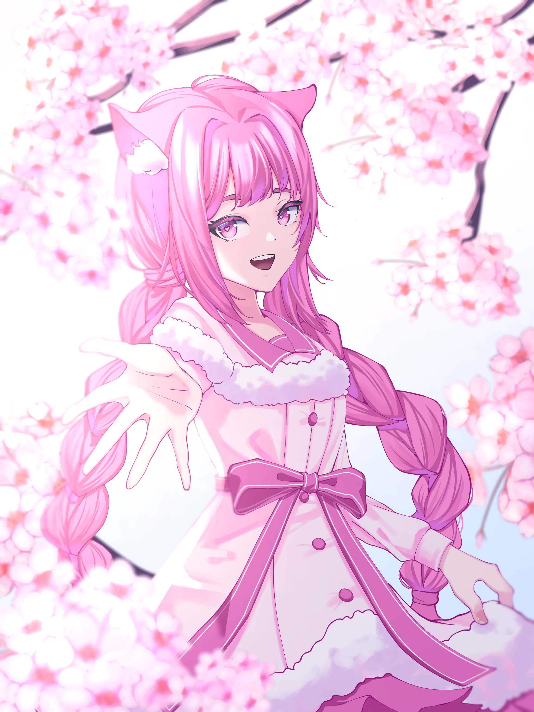

<h2 align="center">😺 About me 😺</h2> 

<li><b>Name:</b> HelloYeew (ヘローイーオ)</li>
<li><b>Education:</b> Sophomore in Software and Knowledge Engineering</li>
<li><b>Working On:</b> <a href="https://github.com/HelloYeew/maisim">maisim</a> | <a href="https://github.com/Rurusetto/rurusetto">rūrusetto</a> | Other open source</li>
<li><b>Goal:</b> To work on something that I love at my favorite country!</li>
<li><b>❤️ Anime:</b> Dunno, I watch everything </li>
<li><b>❤️ Color:</b> <a href="https://www.color-hex.com/color-palette/104633">osu! pink</a>, purple and blue color tone</li>
<li><b>❤️ Band:</b> <a href="https://bandori.fandom.com/wiki/Poppin%27Party">Poppin'Party</a> and YOASOBI</li>
<li><b>❤️ IDE:</b> Every IDE made by JetBrains, especially <a href="https://www.jetbrains.com/rider/">Rider</a> and its family</li>
 
 
 

I listed all the tools that I use for setup my workflow <a href="https://github.com/HelloYeew/workflow-setup">here</a>.

## 📇 Skills 📇

         

These are my main languages, framework and some tools that I use mainly. I love to work on some backend stuff including graphic design stuff (but I cannot draw).

## 🎵 Music 🎵

I normally listen to music everyday since it makes me not dead inside or pretend to be dead. In case you want to know more <a href="https://www.last.fm/user/HelloYeew">yes, I'm still using last.fm </a>.

<!-- lastfm -->

              

Here is the latest top album that I've listened most. It updates on the daily basis using <a href="https://github.com/melipass/lastfm-to-markdown/">this awesome workflow that I contribute</a> to make the link work. (づ｡◕‿‿◕｡)づ

## 📝 Contact time! 📝

  

You can contact me using these ways. Don't hesitate to contact me, I'm waiting!

 

---

<b><a href="https://www.helloyeew.dev">homepage</a> | <b><a href="https://story.helloyeew.dev/">blog</a>

Made with ❤️ by me

