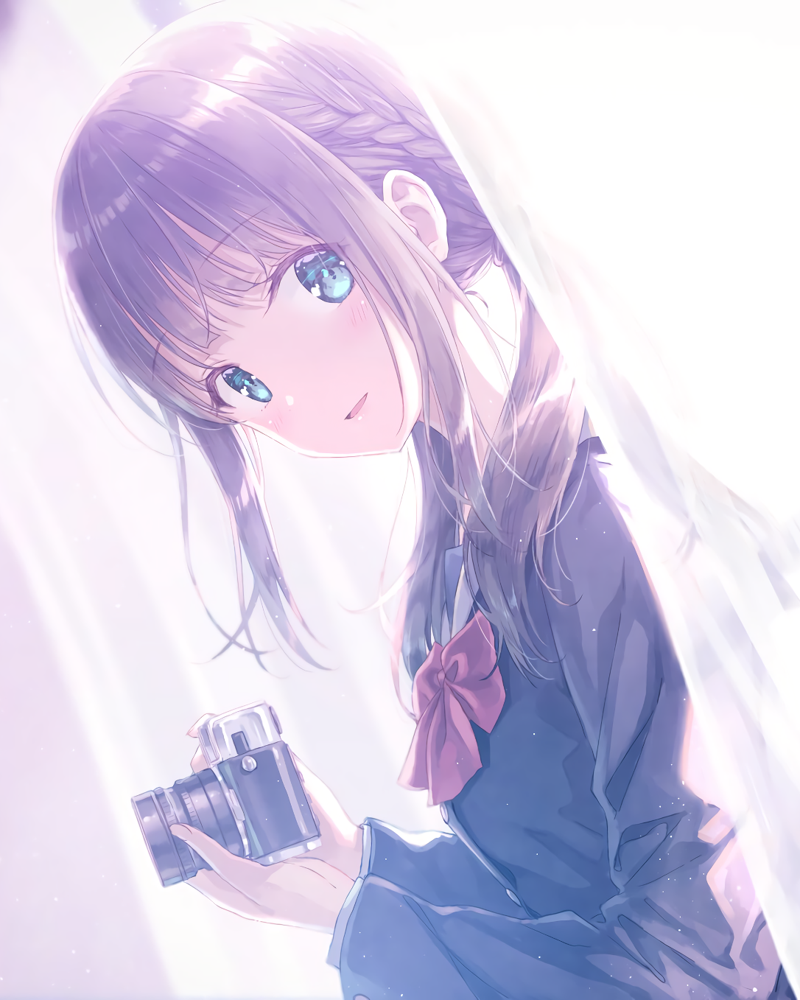
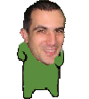

<h2 align="center">😺 About me 😺</h2> 

<li><b>Name:</b> HelloYeew (ヘローイーオ)</li>
<li><b>Education:</b> Sophomore in Software and Knowledge Engineering</li>
<li><b>Working On:</b> <a href="https://github.com/Rurusetto/rurusetto">rūrusetto</a> | <a href="https://github.com/HelloYeew/maisim">maisim</a> | Other open source</li>
<li><b>Goal:</b> Work on something that I love at my favorite country!</li>
<li><b>❤️ Anime:</b> Dunno, I watch everything </li>
<li><b>❤️ Color:</b> <a href="https://www.color-hex.com/color-palette/104633">osu! pink</a> and purple color tone</li>
<li><b>❤️ Band:</b> <a href="https://bandori.fandom.com/wiki/Poppin%27Party">Poppin'Party</a></li>
<li><b>❤️ Idol:</b> <a href="https://github.com/peppy">peppy </a></li>
 

## 📇 Knowledge 📇

        

I love to working on some backend stuff with some graphic design stuff (but I cannot draw).

## 🎵 Music 🎵

I normally listen to music all days since it make me not dead inside or pretend to be dead. And if you want to know more <a href="https://www.last.fm/user/HelloYeew">yes, I'm still using last.fm </a>.

<!-- lastfm -->

          

Here is my latest top album that I've listened most. Update every day using <a href="https://github.com/HelloYeew/lastfm-to-markdown">this fork workflow</a> to make the link work. (づ｡◕‿‿◕｡)づ

## 📝 Contact time! 📝

  

And  no osu! badge here so <a href="https://osu.ppy.sh/users/18735426">here is my 6 digits profile </a> .

 

---

<b><a href="https://www.helloyeew.dev">homepage</a> | <a href="https://blog.helloyeew.dev/">blog</a> | <a href="https://garden.helloyeew.dev/">digital garden</a></b>

Made with ❤️ by me

